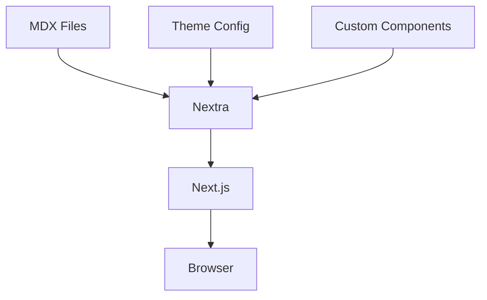

# Architecture

## Overview

Nextra is built on top of Next.js and provides a powerful documentation framework. Here's how it works:

## Key Components

### 1. Next.js Core
- File-based routing
- Server-side rendering
- Static site generation
- API routes

### 2. MDX Support
- Write content in Markdown
- Use React components
- Custom components support
- Syntax highlighting

### 3. Theme System
- Customizable themes
- Dark mode support
- Responsive design
- Navigation customization

## Data Flow



## Directory Structure

```
my-docs/
├── pages/
│   ├── _meta.js
│   ├── index.mdx
│   └── about.mdx
├── components/
│   └── custom.jsx
├── theme.config.jsx
└── next.config.js
```